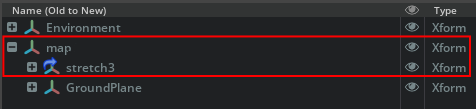

# IsaacSim setup for the Hello Robot Stretch 3

## Prerequisites

- NVIDIA GPU with up-to-date drivers
- [Pixi](https://pixi.prefix.dev/latest/installation/)


## Quick Start
This repository provides an Isaac Sim environment for deploying and testing the Hello Robot Stretch with ROS 2.
A minimal end-to-end workflow is as follows:
1. Install [Pixi](https://pixi.prefix.dev/latest/installation/)
2. Activate/install the Pixi environment (this installs IsaacSim)
    ```bash
      pixi shell
    ```
3. Start IsaacSim (or use the [scripted start below](#simulation-script))
    ```bash
      isaacsim
    ```
3. Open the [provided example scene](example_scene_hm3d.usd) from the Habitat Matterport 3D set with already imported stretch robot (in the entrance area)
4. Play the simulation.
5. Test ROS2 integration (Seperate terminal. To run these you need a ROS2 installation, which is not included in the minimal ROS2 install included with IsaacSim.)
    - `ros2 topic echo /tf`
    - `ros2 topic pub /stretch/cmd_vel geometry_msgs/msg/Twist "{linear: {x: 0.2}}"`

This README explains each step in more detail below.

## Manual robot import

If your scene does not already include the robot:
  - Import `robot_usd/stretch3.usd` into the current stage
  - Use **File > Import Reference** or drag-and-drop it via the content browser
  - In the scene graph, make sure to import the robot below the root prim `/map` as the name of this prim is used as the global reference frame when publishing to ROS
  

## Simulation script

Run `pixi run python standalone_sim.py` to launch IsaacSim loading a sample scene and the robot in a scripted manner. Check `pixi run python standalone_sim.py --help` for more options (such as loading a different scene).

> API Documentation of [IsaacSim](https://docs.isaacsim.omniverse.nvidia.com/5.1.0/py/source/extensions/isaacsim.core.api/docs/index.html)


## Directory Layout

- `robot_usd/` - ready made robot usd for import into other scenes (ROS enabled)
- `example_scene_hm3d.usd/` - Issac Sim USD stage with the imported robot (Habitat Matterport 3D dataset)
- `Robot_Import_Files/` - modified URDF with updated collision meshes
- `README.md` - this file
- `standalone_sim.py` - python script for [scripted simulation ](#simulation-script)

## ros2-bridge

- `ros2-bridge` plugin enabled in Isaac Sim 
  - It is already automatically enabled. 
  - Go to Window > Extensions, find "ROS 2 Bridge," and verify it is **Enabled**.

## Recreating the ready-made robot models

### Import Process

Adapted from the Isaac Sim docs:  
- https://docs.isaacsim.omniverse.nvidia.com/5.1.0/importer_exporter/importers_exporters.html 
- https://docs.isaacsim.omniverse.nvidia.com/5.1.0/ros2_tutorials/ros2_landing_page.html

1. **Create or Open an Isaac Sim Scene**  
   You may either open an existing prepared scene or create your own.
   > **DON'T WORRY** 
   >
   >It may take a **long time during the first launch**. (roughly 15 min for work stations and 20 min for laptops)

   - InteriorAgent Dataset: https://huggingface.co/datasets/spatialverse/InteriorAgent/tree/main

   - `example_scene_hm3d.usd`
      - Contains an HM3D environment with Stretch already imported  
       Dataset: https://github.com/matterport/habitat-matterport-3dresearch

    > **Note:**  
    > If you try to open either of these two scenes, make sure you have downloaded the corresponding datasets and that Isaac Sim can locate them on your local system.  
    >  
    > After opening one of these scenes, you may skip **Step 2**.

   You may also use built-in Isaac Sim assets:
   - Navigate to **Content > Isaac Sim** to browse default environments and props.

   **Physics note:**  
   For objects to interact physically with the robot:

   - Select the object in the **Stage** window  
   - Right-click → **Add > Physics > Rigid Body**  
   - Add a **Collider Preset**

2. **Import the Stretch as USD File** 
  If your scene does not already include the robot:
    - Import `robot_usd/stretch3.usd` into the current stage
    - Use **File > Import Reference** so the robot remains reusable
    - In the scene graph, make sure to import the robot below the root prim `/map` as the name of this prim is used as the global reference frame when publishing to ROS

    Model details:
    - Original URDF used square collision meshes on the wheels, which caused physics artifacts.  
    - Replace them with cylinders; see `Robot_Import_Files/`.  
    - Enable self-collision and set the base link movable.
  
3. **Tune joint dynamics**
  Proper joint tuning is critical for stable simulation.

  - **Wheels** 
    - Joints: `joint_right_wheel` and `joint_left_wheel`
    - Recommended parameters
      - Armature: 2.0 kg·m² (reduces jitter)  
      - Damping: 1000
      - Stiffness: 0  
      - Max torque and break force clamped

    > Where to set this in the UI:
    > - Select the wheel joint in the Stage window
    > - Open the Property panel
    > - Navigate to **Physics > Articulation > Drive**

  - **Positional joints (arm, lift, wrist)**  
    - Armature: 0.1 kg·m²  
    - Damping & stiffness hand-tuned via GUI  
      - **Tools > Robotics > Asset Editors > Gain Tuner**

4. **ROS 2 Bridge configuration**
  (synchronized to system time)  
    - Adapt or reuse OmniGraph templates from **Window > Graph Editors > Action Graph**

      

    - **ROS2 Topic Overview**
    
      | Component | Topics                           | Direction | Purpose                     |
      | :--------- | :-------------------------------- | :--------- | :--------------------------- |
      | Base      | `/stretch/cmd_vel`               | Sub       | Differential drive control  |
      | Joints    | `/joint_command`, `/joint_state` | Sub / Pub | Joint commands and feedback |
      | Camera    | `/spectacular_ai/*`              | Pub       | RGB, depth, point cloud     |
      | Lidar     | `/scan_filtered`                 | Pub       | Laser scan                  |
      | TF        | `/tf`, `/tf_static`              | Pub       | Coordinate transforms       |
      | State     | `/state_estimator/pose_filtered` | Pub       | Estimated robot pose        |
      | Homing    | `/is_homed`                      | Pub / Srv | Robot homing status         |

### Launching the Simulation
1. Enter the Pixi environment in the root diretory of this repo:
    ```bash
    pixi shell
    ```
2. Launch Isaac Sim
    ```bash
    isaacsim
    ```
3. Open a scene or import the Stretch USD.
4. Press **Play** to start the simulation.
5. Run ROS2 nodes in a separate terminal.

### Testing

1. **Base Motion Control (`/stretch/cmd_vel`)**
  - This command controls the differential drive of the robot base.
      ```bash
      ros2 topic pub --once /stretch/cmd_vel \
      geometry_msgs/msg/Twist "{linear: {x: 0.0, y: 0.0, z: 0.0}, angular: {x: 0.0, y: 0.0, z: 0.5}}"
      ```
    > Expected behavior:
    > - The robot rotates in place.
    > 
    > If the robot does not move:
    > - Check wheel material
    > - Check wheel joint drive settings
    > - Verify ground plane has a collider
    > - Ensure simulation is playing

2. **Joint-Level Control (`/joint_command`)**
  - This command controls individual articulated joints (arm, lift, wrist).
    ```bash
    ros2 topic pub /joint_command \
    sensor_msgs/JointState "{name: ['joint_lift'], position: [0.2]}"
    ```

  - Verify feedback:
    ```bash
    ros2 topic echo /joint_state
    ```
    > Expected behavior:
    > - The joint moves to the commanded position.
    > - `/joint_state` reflects the correct value.
    > 
    > If the joints do not move:
    > - Check the lower/ upper limit or max force value of the joints.
    > - Recheck armature, damping, and stiffness values.

    
